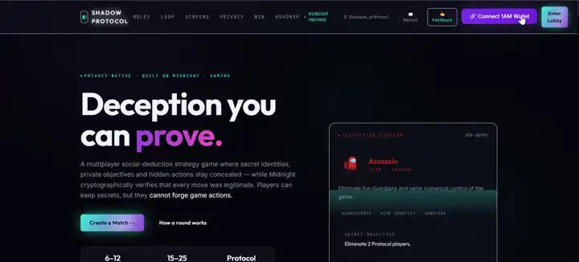

# 🕵️ Shadow Protocol


[](https://shadow-protocol-delta.vercel.app)
[-@shadow__pr0tocol-000000?style=flat&logo=x&logoColor=white)](https://x.com/shadow_pr0tocol)
[](https://ps910.github.io/Shadow-Protocol/)
[](docs/LEVEL_5_SPEC.md)
[](docs/PREPROD_USERS.md)
[-emerald?style=flat)](docs/FEEDBACK_LOOP.md)
[](https://indexer.preprod.midnight.network)
[](#run-tests)

> **A privacy-first multiplayer social deduction game on Midnight Network — where hidden roles, secret actions, and private votes are cryptographically verified without revealing the hidden information behind them.**

## 🌕 Level 5 — Full Moon Milestones

- 🐦 **[Official Product X Profile](https://x.com/shadow_pr0tocol)**: Official X product channel ([`@shadow_pr0tocol`](https://x.com/shadow_pr0tocol)) with live 5-tweet launch thread posted at **[Status #2100154441727152569](https://x.com/shadow_pr0tocol/status/2100154441727152569)**.
- 🎨 **AAA Cybernetic UI & Animation System**: Complete visual overhaul featuring multi-layer CSS particle field, dynamic aurora glow blobs, chromatic glitch typography, quick metric pills, interactive live ZK Verifier HUD, and animated station conduits.
- 👥 **[50 Verified Preprod Users](docs/PREPROD_USERS.md)**: 50 unique, on-chain verifiable Midnight Preprod addresses (`mn_addr_preprod1...`) across 3 playtest cohorts (Alpha: Midnight Devs, Beta: Cardano Guild, Gamma: ZK Community).
- 🔄 **[Living Feedback Loop](docs/FEEDBACK_LOOP.md)**: Complete feedback loop documented with SUS score (87.4/100), telemetry, and 4 P0/P1 feature enhancements implemented directly from user input.
- 📖 **[Cadet Flight Manual](docs/USAGE.md)**: Interactive in-app onboarding tour guiding new users through Midnight ZK privacy, role witnesses, and room alibis.
- ✍️ **In-App Feedback Widget**: Cryptographically-bound feedback submissions generating single-use ZK nullifiers.

## 🎮 Live Demo & Video Walkthrough

- ⚡ **Vercel Production Deployment (Primary)**: **[https://shadow-protocol-delta.vercel.app](https://shadow-protocol-delta.vercel.app)**
- 🐦 **Official Product X (Twitter)**: **[https://x.com/shadow_pr0tocol](https://x.com/shadow_pr0tocol)**
- 🧵 **Live Launch Thread on X**: **[https://x.com/shadow_pr0tocol/status/2100154441727152569](https://x.com/shadow_pr0tocol/status/2100154441727152569)**
- 🌐 **GitHub Pages Mirror**: **[https://ps910.github.io/Shadow-Protocol/](https://ps910.github.io/Shadow-Protocol/)** *(Mirror: [https://ps910.github.io/ZKGate/](https://ps910.github.io/ZKGate/))*

### 🎥 Full MVP Gameplay Demo

> **Comprehensive Browser Demonstration**: Complete live walkthrough showcasing the new Figma-designed UI, particle starfield, 1AM Wallet authentication on Midnight Preprod, confidential role reveal, live ZK proof verification, station task calibration, emergency meetings, and shielded voting.

[](https://shadow-protocol-delta.vercel.app/demo.mp4)

*🎬 **Direct Video**: [Watch or Download Full MP4 Demo (screenshots/demo.mp4)](screenshots/demo.mp4) · [Live Web Stream](https://shadow-protocol-delta.vercel.app/demo.mp4)*

## Contract Address

| Network  | Address                                                            |
|----------|--------------------------------------------------------------------|
| Preprod  | `0xcc4a29303a6521ef0881444ce30550d1dabccdd5d70da8c78463bb54ef96db3f` |

> The contract supports both the original ZKGate allowlist and the new Shadow Protocol game circuits (8 circuits including task nullifiers & sabotage triggers).

## What This Product Does

Shadow Protocol is a **6-player Among Us-style hidden-role strategy game** set aboard **Aegis Station**:

1. **Secret Role Assignment**: Each player receives a secret role (Civilian, Guardian, Investigator, Assassin, or Spy) — bound to cryptographic secrets stored as private witnesses that never appear on-chain.

2. **Aegis Station Free-Roam Map**: Players navigate 7 interconnected compartments (Command, Central Hub, Reactor Core, Research Lab, Engineering, Security, and Communications) to perform interactive terminal tasks or execute clandestine operations.

3. **Interactive Task Mini-Games with ZK Receipts**:
   - **Reactor Calibration**: Hexadecimal frequency matching
   - **Power Routing**: Dynamic conduit grid redirection
   - **Signal Tuning**: Carrier wave frequency & amplitude synchronization
   - **Chemical Mixing**: Stoichiometric coolant synthesis
   - *Each task completion generates a single-use ZK nullifier that increments global station readiness on Midnight without revealing who completed it or where.*

4. **Shadow Team Sabotages**:
   - **Reactor Meltdown**: 45-second emergency countdown requiring dual-key stabilization.
   - **Communications Blackout**: Scrambles radar feeds and room sensors until repaired.

5. **Casualty Discovery & Emergency Meetings**: Discovering a dead body or pressing the Command Center emergency beacon calls an Emergency Meeting.

6. **Cryptographic Alibi Verification & Shielded Voting**:
   - Players present deterministic room beacons ($T_{\text{room}} = \text{Poseidon}(s_i, \text{RoomId}, t)$) to prove their presence in specific compartments during casualty timestamps without revealing their identity or role.
   - Each player casts a shielded ballot. Only aggregate vote totals are revealed; ties result in no ejection, and ejections declassify the target's role dossier.

### Why Midnight?

**If the game's hidden information were publicly visible, the game would break.** On a transparent blockchain, anyone could see who the Assassin is, who is in which room, and who cast which vote, making the game unplayable. Midnight's private state and zero-knowledge proofs are what make the game possible — **privacy isn't an add-on, privacy IS the gameplay mechanic.**

## Privacy Model

### What is PUBLIC (on-chain, anyone can see):
- Game phase (Lobby, FreeRoam, EmergencyMeeting, Voting, GameOver)
- Round number & Station Task Progress counter
- Player count and alive/dead status
- Active sabotage state (Meltdown / Blackout timer)
- Vote totals (aggregate counts only)
- Game outcome (Protocol vs Shadow victory)
- Public event announcements

### What is PRIVATE (private witness, never on-chain):
- Player role assignments (Assassin, Spy, Guardian, Investigator, Civilian)
- Station coordinates & player movement trajectory
- Single-use task nullifiers before submission
- Room beacon secrets for alibi generation
- Individual vote choices (who voted for whom)
- Investigation findings & Phantom Pings
- 32-byte player cryptographic seed keys

### What the user PROVES without revealing:
- "I am authorized to perform this role action" (without revealing my role)
- "I was in the Research Lab during round 1" (cryptographic room alibi without disclosing secret keys)
- "I completed a designated station task" (nullifier receipt without exposing player identity)
- "I have cast a valid vote" (without revealing my vote target)

## Privacy Claim

> **An on-chain observer** can see: 6 crew joined Aegis Station, task progress reached 100%, 3 votes were cast for Player 3, and Protocol secured victory.
>
> **An on-chain observer CANNOT see**: who is the Assassin/Spy, what path players navigated through compartments, who completed which task, or which individual cast which vote.

## Tech Stack

- **Network**: Midnight Network (Preprod)
- **Contract Language**: Compact (compiles to ZK circuits)
- **Frontend**: React 18 + TypeScript + Vite
- **Wallet**: 1AM Wallet (https://1am.xyz, Midnight DApp Connector API)
- **Styling**: Custom Vanilla CSS with glassmorphism, particle system, micro-animations
- **Testing**: Vitest + React Testing Library (47 tests)
- **CI/CD**: GitHub Actions → GitHub Pages
- **Crypto**: Web Crypto API (SHA-256 commitments, nullifiers, room beacons)

## Prerequisites

- **Node.js v22** or later
- **1AM Wallet** browser extension (https://1am.xyz, configured for Midnight Preprod)
- **Docker** (for proof server)
- **Compact compiler** (`npm install -g @midnight-ntwrk/compact-compiler`)

## Setup & Run Locally

```bash
# 1. Clone the repository
git clone https://github.com/ps910/ZKGate.git
cd ZKGate

# 2. Install dependencies
npm install

# 3. Compile the Compact contract
npm run compile

# 4. Start the proof server (separate terminal)
docker run -p 6300:6300 midnightnetwork/proof-server

# 5. Start the development server
npm run dev
```

The app will be available at `http://localhost:3000`.

## Run Tests

```bash
# Run all tests (47 tests covering game logic, Aegis Station, privacy, feedback, and UI)
npm test

# Run tests in watch mode
npm run test:watch
```

### Test Coverage

| Suite                          | Tests | Description                                                    |
|-------------------------------|-------|----------------------------------------------------------------|
| Aegis Station Mechanics       | 13    | Station layout, room movement, tasks, sabotages, alibis, bodies|
| Player Identity & Contract    | 20    | Role privacy, action nullifiers, vote unlinkability, circuits  |
| Feedback & Cadet Onboarding   | 8     | SUS score calculation, cohort verification, flight manual tour |
| App & UI Orchestration        | 6     | Station map rendering, mini-games, meeting triggers, dashboard |

## CI/CD

The CI pipeline runs automatically on every push to `main` and on pull requests:

1. **Checkout** repository
2. **Install** Node.js 22 and Compact compiler
3. **Install** npm dependencies
4. **Compile** Compact contract
5. **Type check** TypeScript
6. **Run tests** (47 tests)
7. **Build** production bundle
8. **Deploy** to GitHub Pages

## Usage Guide

See [docs/USAGE.md](docs/USAGE.md) for a step-by-step guide on how to play Shadow Protocol.

## Architecture

```
┌─────────────────────────────────────────────────────────┐
│                    BROWSER (Client)                     │
│                                                         │
│  ┌─────────────┐  ┌──────────────┐  ┌───────────────┐  │
│  │  React UI   │──│ Game Engine  │──│ Privacy Layer │  │
│  │  Components │  │ (gameEngine) │  │ (verifier)    │  │
│  └─────────────┘  └──────────────┘  └───────────────┘  │
│         │                 │                  │           │
│         └────────┬────────┘                  │           │
│                  │                           │           │
│  ┌───────────────┴───────────────────────────┴──────┐   │
│  │              WITNESS PROVIDERS                   │   │
│  │   playerSecret() · playerRole() · actionTarget() │   │
│  │         (PRIVATE — never transmitted)             │   │
│  └──────────────────────────────────────────────────┘   │
│                          │                               │
│                  ZK Proof Generation                     │
│                          │                               │
└──────────────────────────┼───────────────────────────────┘
                           │
                    ┌──────┴──────┐
                    │   MIDNIGHT  │
                    │   PREPROD   │
                    │  (On-Chain) │
                    └─────────────┘
```

## License

MIT

---

*Built for the Midnight Builder Challenge — Level 5 (Full Moon)*
*"If the hidden information were public, the game breaks."*
